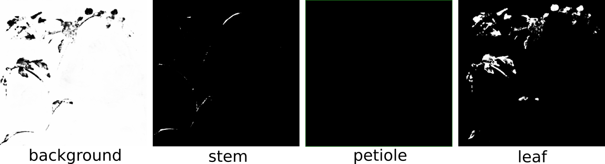
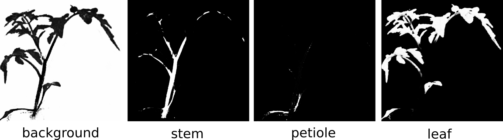
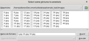
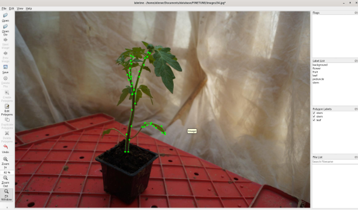
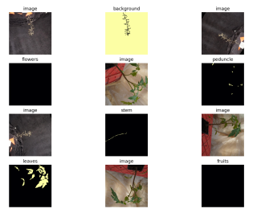
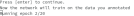

# Segmentation module
This module requires colmap step to be completed and preferably uses Undistorted images. 
For each image in the scan, it generates 6 images corresponding to the prediction mask of the classes Background, Stem, Flower, Fruit, Leaf and Peduncle.


This images are generated by a segmentation neural network. This network has been trained on virtual images of arabidopsis generated with ROMI's [blender virtual scanner](https://github.com/romi/blender_virtual_scanner).

It is possible to annnotate manually real images taken with the scanner to improve the segmentation predictions and 3D reconstruction with the Annotation and Fine-Tuning tool.


# Annotation and finetuning tool

### Introduction

This script allows you to fine-tune a pixel-per-pixel segmentation network on your own dataset of images.

The first part of the script allows you to generate this dataset by manually annotating images of your choice using LabelMe.

The second part consists in training a pre-trained network of your choice on your new dataset.

Example of use: ROMI pipeline segmentation.
The segmentation networks integrated in the ROMI pipeline were trained on arabidopsis. If you want to reconstruct another plant species, for example from a 3D scan of a tomatoe, it will hardly work:

The present module allows you to annotate manually images from the scan of tomatoes, and re-train the network. Then, launch the pipeline again with the updated network. The results are good enough to allow a 3D reconstruction.


This tool relies on the file pipeline.toml used by the virtual scanner. 

### Installation

From the virtual environment created for Scan3D: 
```
git clone https://github.com/romi/Segmentation
```


### Preliminary set-up

First update the pipeline.toml folder according to the one in this directory.

You need to give a save location for your new database: directory_images (replace the 'complete here' by location full path)

You need to give a fetch and save location for the weights of the segmentation networks: directory_weights (replace the 'complete here' by location full path). 

If the pre-trained network is not already present in this folder, it will be fetched from the database db.romi-project.eu.

You can also change the number of epochs for the training.

### Runing the tool
```
ipython
>import open3d #due to conflict between open3d and Torch, open3d has to be imported first
>from romiseg.utils.finetune import finetune
>finetune()
```
### Set-by-step

(If you haven't correctly filled the pipeline.toml file to give correct folder location, pop-up windows will ask you to indicate the location of the folders where to save dataset and weights.)

First you will have to select images you want to annotate. 3 images should be enough.




Then, LabelMe will pop-up with the first selected image. You can annotate the image with the "Create Polygon" function. The classes are flower, stem, leaf, fruit, peduncle and are already set-up in LabelMe.



Save the .json label file in the suggested folder (it corresponds to directory_images where the images you just selected have also been copied).

When you close LabelMe the next image you have selected will automaticall pop-up.

When all the images are labelled a pop-up image will show a random sample of the training dataset you have generated. Close this window and press enter.



The training will automatically start for the number of epochs indicated in pipeline.toml



Once the training is over, the weights are automatically saved in the weights folder and the pipeline.toml file is updated with the name of the fine_tuned segmentation network.

You can launch the scan3D pipeline on the scan and the result should be better then before the fine-tuning.
 


