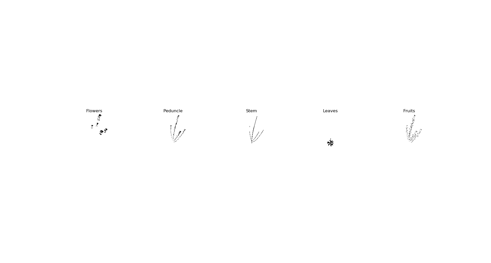

# Segmentation
Virtual plant segmentation methods using 2D images generated from the virtual scanner and neural networks. Python/Pytorch

# Database
The database is generated using the virtual scanner (https://github.com/romi/blender_virtual_scanner). The first step is to activate the virtual scanner following the steps described in the repo.

The class virtual_scan in save_images repo is used to generate the images and the labels from the virtual arabidopsis database.

*Note on the labels: when the 3D cloud is projected onto images with the pinhole model, many points of the cloud project onto the same pixel. Therefore, one pixel can be associated to several classes.
We keep this representation when collecting the labels. 
The point cloud is projected onto images for each class, and we use hot encoding to represent the multiclass. 
For example if both flowers and leaves project onto one pixel, the class will be 10100 (there are 5 classes in total). 
To save the labels in a more compact way, we encode the label into its decimal form, as the label can be seen as a binary number. 
2⁵ = 32 therefore the labels are encoded in a grey-level image with values between 0 and 31.*

The images and labels are then loaded in PyTorch format using a custom dataloader.

# Learning phase in 2D
CNNs to test: DeepLab, SegNet, Unet...

# 2D features to 3D compatible with Pytorch
The real scanner space carving is based on finding the features of a 3D point in projected onto each view of the scanning images. 
The same process was implemented in Pytorch taking avantage of the GPU to store the 3D space coordinates.

